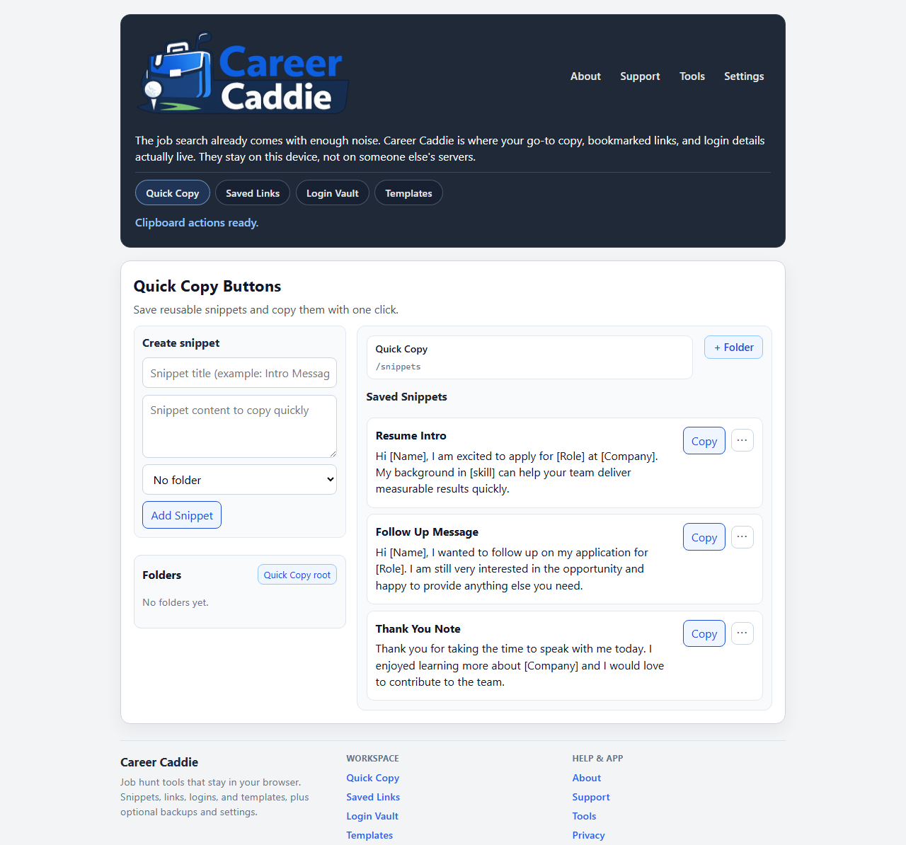

# Career Caddie

[](https://github.com/Migsrkrd/CareerCaddie/actions/workflows/deploy-pages.yml)
[](https://migsrkrd.github.io/CareerCaddie/)

<p align="center">
  
</p>

Career Caddie is a frontend-only job search companion for storing your most-used snippets, saved links, login credentials, and reusable templates in one place.

Everything stays in your browser on your device unless you explicitly export or copy it.

## Why this project exists

Job hunting usually means dozens of tabs, repeat typing, and scattered notes. Career Caddie helps reduce that friction by giving you one focused workspace for recurring application tasks.

## Core features

- **Quick Copy:** Save reusable outreach lines and copy them with one click.
- **Saved Links:** Track job posts and company pages with notes and optional icon scraping.
- **Login Vault:** Keep usernames/emails and passwords together for application portals.
- **Templates:** Use bracket placeholders (example: `[name]`) and generate filled messages.
- **Folders:** Organize snippets, links, logins, and templates in nested folder trees.
- **Settings + backups:** Export/import JSON backups, tune behavior, and inspect local storage usage.

## Privacy-first by design

- No backend required to use the app
- Data is stored locally in browser storage (IndexedDB + localStorage)
- Content leaves your device only when you copy text or export a backup file

## Tech stack

- React 19
- TypeScript
- Vite
- React Router
- IndexedDB (`idb`)

## Local development

```bash
npm install
npm run dev
```

## Production build

```bash
npm run build
npm run preview
```

## Deployment

This repository deploys automatically to GitHub Pages when changes are merged/pushed into `main` via `.github/workflows/deploy-pages.yml`.

If needed, set repository Pages source to **GitHub Actions** in repo settings.

## Project preview

<p align="center">
  
</p>
